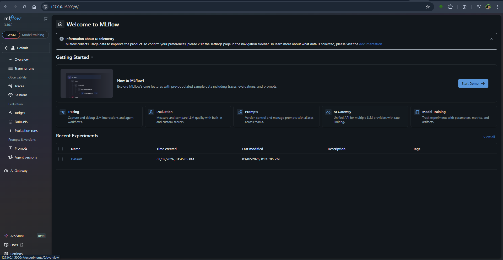

# MLflow Test Project

This project demonstrates the use of **MLflow** for tracking machine learning experiments. It includes a training script that trains an ElasticNet regression model on the Wine Quality dataset.

## Features
- **MLflow Tracking**: Logs parameters, metrics, and models.
- **ElasticNet Regression**: Implements a regression model using scikit-learn.
- **Wine Quality Dataset**: Uses a publicly available dataset for training and testing.

## Requirements
- Python 3.7+
- Required libraries are listed in `requirements.txt`. Install them using:
  ```bash
  pip install -r requirements.txt
  ```

## Usage
1. Run the training script:
   ```bash
   python train.py <alpha> <l1_ratio>
   ```
   Replace `<alpha>` and `<l1_ratio>` with desired values. Defaults are 0.5 and 0.5.

2. Start the MLflow UI to visualize the experiment results:
   ```bash
   mlflow ui
   ```

3. Open the MLflow UI in your browser at `http://127.0.0.1:5000`.

## Project Structure
- `train.py`: Training script for the ElasticNet model.
- `requirements.txt`: Lists the dependencies.
- `README.md`: Project documentation.

## Example Output
Below is an example of the MLflow UI:


